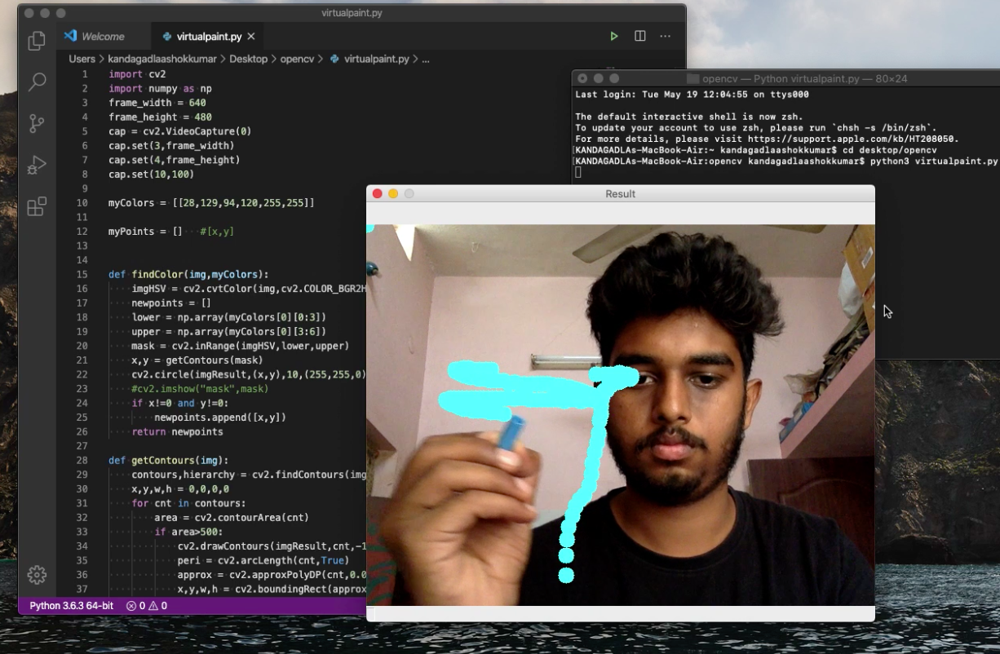

# Virtual-Paint
#Overview
This is a basic application of opencv. Here the object color of the marker is detected using contour and we can get the values of pixels where the center is present and we can draw points continuously so we can detect multiple colors to make it much intresting!!! 

